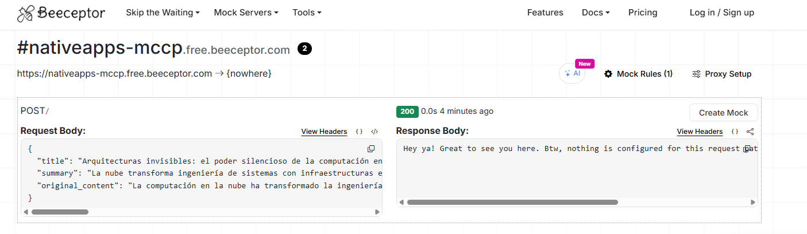
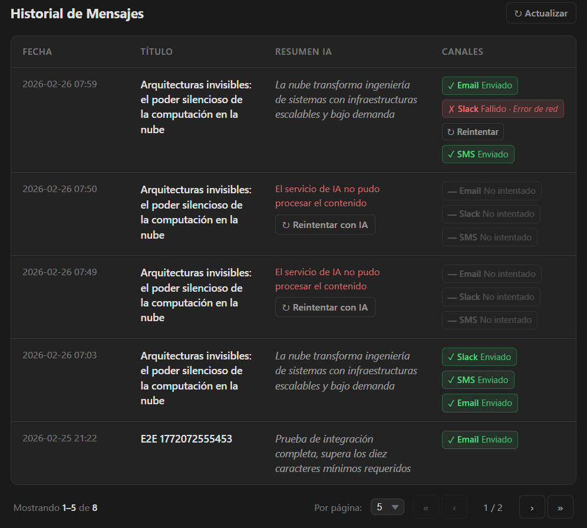

# Multi-Channel Content Processor (MCCP)

Aplicación full-stack que permite redactar un contenido, procesarlo mediante IA para obtener un **resumen ejecutivo (máx. 100 caracteres)** y distribuirlo simultáneamente a múltiples canales: **Email**, **Slack (Webhook)** y **SMS Legacy (SOAP)**.

---

## Descripción de la Solución

El flujo central es simple: el usuario escribe un título y un contenido, selecciona uno o más canales y presiona **Enviar**. El backend procesa el contenido con la IA configurada, persiste el mensaje con su resumen y dispara un **Job independiente por canal** usando la cola de Laravel.

```
[Frontend] → POST /api/messages
                 ↓
         [ProcessMessageAction]
                 ↓
         [AI Provider (Gemini / OpenAI / Anthropic)]
                 ↓  resumen ≤ 100 chars
         [Message persisted]
                 ↓
         [MessageProcessed event]
                 ↓
         [DispatchChannelsListener]
                 ↓
         [DispatchToChannelsAction]
         ↓           ↓           ↓
   [EmailJob]  [SlackJob]   [SmsJob]   ← Jobs independientes en cola
```

Si la IA falla, el flujo se detiene (sin envíos). Si un canal falla (ej. timeout en Slack), los demás se procesan de forma independiente. Cada intento queda registrado en `delivery_logs` con su estado (`pending` / `success` / `failed`).

### Stack

| Capa | Tecnología |
|------|-----------|
| Backend | Laravel 12 · PHP 8.2 · MySQL |
| Frontend | React 19 · Vite 7 · TypeScript |
| IA | Gemini 2.5 Flash (default) · OpenAI · Anthropic |
| Estado servidor | TanStack Query (React Query) |
| Estado cliente | Zustand |
| Tests backend | PHPUnit 11 |
| Tests frontend | Vitest 4 · Testing Library · MSW 2 |
| Tests E2E | Playwright |

### Patrones de Diseño

- **Strategy** — `NotificationProvider` contract + un adapter por canal (`EmailChannelAdapter`, `SlackChannelAdapter`, `SmsChannelAdapter`). Agregar WhatsApp mañana significa crear una nueva clase que implemente la interfaz, sin tocar la lógica existente.
- **Factory** — `AiProviderFactory` resuelve el proveedor de IA según `AI_PROVIDER` en `.env`.
- **Observer / Events** — `MessageProcessed` event desacopla el procesamiento de IA del despacho a canales.
- **Actions (Use Cases)** — `ProcessMessageAction`, `DispatchToChannelsAction`, `RetryChannelAction` encapsulan la lógica de negocio.
- **Value Object** — `Summary` garantiza que el resumen sea válido (máx. 100 chars) antes de llegar a la base de datos.

---

## Requisitos Previos

- PHP ≥ 8.2 + Composer
- Node.js ≥ 20 + npm
- Una base de datos relacional compatible con Laravel: **MySQL 5.7+**, **PostgreSQL 9.4+** o **SQLite 3.38+** (el proyecto fue desarrollado y probado con MySQL; no existen consultas específicas de ningún motor.)
- Una API Key de Gemini, OpenAI o Anthropic

---

## Configuración e Instalación

### 1. Clonar el repositorio

```bash
git clone https://github.com/Javier-Aceros/nativapps
cd nativapps
```

### 2. Backend (Laravel)

```bash
cd backend
composer install

# Copiar variables de entorno
cp .env.example .env

# Generar clave de aplicación
php artisan key:generate
```

Editar `backend/.env` con los valores correspondientes:

```dotenv
# Base de datos (mysql | pgsql | sqlite)
DB_CONNECTION=mysql
DB_DATABASE=mccp
DB_USERNAME=root
DB_PASSWORD=tu_password

# URL del frontend (para CORS)
FRONTEND_URL=http://localhost:5173

# Proveedor de IA (gemini | openai | anthropic)
AI_PROVIDER=gemini
GEMINI_API_KEY=tu_api_key_de_gemini

# Slack — URL del webhook real
SLACK_WEBHOOK_URL=https://nativeapps-mccp.free.beeceptor.com

# SMS — número destino para el XML SOAP
SMS_DESTINATION=+570000000000
```

```bash
# Migrar la base de datos
php artisan migrate

# Iniciar el servidor
php artisan serve
```

```bash
# En una terminal separada: iniciar el worker de colas
php artisan queue:work
```

> **Importante:** si modificas cualquier variable de `.env` mientras el worker está corriendo, debes reiniciarlo para que tome los nuevos valores.

### 3. Frontend (React + Vite)

```bash
cd frontend
npm install
npm run dev
```

La app estará disponible en `http://localhost:5173`. El proxy de Vite redirige `/api/*` a `http://localhost:8000`.

---

## Scripts Disponibles

### Backend

```bash
# Tests (PHPUnit)
php artisan test
```

### Frontend

```bash
# Tests unitarios e integración (Vitest)
npm run test

# Cobertura
npm run test:coverage

# Tests E2E (Playwright — requiere backend corriendo con IA real)
npm run test:e2e

# UI interactivo de Playwright
npm run test:e2e:ui
```

---

## Evidencia

### Slack — Peticiones reales a Beeceptor

Consola de Beeceptor: [https://app.beeceptor.com/console/nativeapps-mccp](https://app.beeceptor.com/console/nativeapps-mccp)

Endpoint receptor: `https://nativeapps-mccp.free.beeceptor.com`



---

### Email — Log en Laravel (`storage/logs/laravel.log`)

El canal Email simula una llamada REST y registra el payload completo en `laravel.log`.


---

### SMS Legacy (SOAP) — Log en Laravel

El canal SMS genera un XML SOAP estructurado y lo registra en `laravel.log`.

```xml
<soapenv:Envelope
  xmlns:soapenv="http://schemas.xmlsoap.org/soap/envelope/"
  xmlns:sms="http://ultracem.com/sms">
  <soapenv:Header/>
  <soapenv:Body>
    <sms:SendSmsRequest>
      <sms:destination>+570000000000</sms:destination>
      <sms:message>[RESUMEN_IA]</sms:message>
      <sms:reference>[TÍTULO]</sms:reference>
    </sms:SendSmsRequest>
  </soapenv:Body>
</soapenv:Envelope>
```


---

### Frontend — Formulario de Envío

Pantalla principal con el formulario de título, contenido y selección de canales.


Al completarse el envío se muestra el resumen generado por la IA.


---

### Resiliencia — Fallo de IA detiene el envío

Si el proveedor de IA devuelve un error (API Key inválida, timeout, cuota agotada, etc.), el flujo se interrumpe **antes** de crear cualquier `DeliveryLog` o disparar jobs. El mensaje queda con `status = failed` y la respuesta HTTP devuelve un `422` con detalle del error. No se realiza ningún envío a los canales.

El mensaje fallido queda registrado y visible en el Dashboard de Historial, donde el botón **"Reintentar con IA"** permite relanzar el procesamiento completo (IA → canales) sin necesidad de volver al formulario.

Por otro lado, cuando la IA falla, el formulario **no se limpia** intencionalmente: es una decisión de arquitectura para que el usuario pueda corregir o ajustar el contenido antes de reenviar, sin perder lo que escribió. Si la intención es solo reintentar sin cambios, el botón del historial es la vía directa.


---

### Resiliencia — Fallo en un canal no bloquea los demás

Cada canal se despacha en un **Job independiente** (`SendToChannelJob`). Si Slack devuelve un timeout (o cualquier otro error HTTP), el job de Slack queda como `failed` en `delivery_logs`, pero los jobs de Email y SMS se procesan con normalidad. El dashboard muestra el estado individual por canal: por ejemplo, `slack: failed` junto a `email: success` y `sms: success` en el mismo mensaje.

Ante un canal fallido, el sistema ofrece **reintento granular**: el botón "Reintentar" disponible en cada canal fallido reintenta **únicamente ese canal**, sin tocar los demás. Los canales que ya completaron con éxito no se vuelven a invocar. Cada reintento queda registrado como un nuevo intento (`attempt`) en `delivery_logs`, preservando el historial completo de intentos anteriores.


---

### Frontend — Dashboard de Historial

Tabla con los mensajes enviados, su resumen de IA y el estado detallado por canal (`success` / `failed` / `pending`). Los reintentos manuales (IA y por canal) están disponibles desde esta vista.




---

## URL de Despliegue

https://nativapps-six.vercel.app/

---

## Notas de Arquitectura

### Estrategia de Testing

El frontend usa **MSW (Mock Service Worker)** como interceptor HTTP en los tests unitarios e integración. Esta elección no es casual: MSW permite interceptar las peticiones reales en el nivel de red, lo que hace posible probar los estados intermedios de **TanStack Query** (`isLoading`, `isError`, caché) de forma realista, sin necesidad de mockear módulos internos.

En cuanto a los tests E2E, el proyecto incluye un test full-flow contra el backend real (`e2e/full-flow.spec.ts`). Esta decisión es completamente consciente: el nivel de cobertura actual es sólido. Las pruebas contra APIs de IA reales son inherentemente inestables (latencia variable, límites de cuota, respuestas no deterministas) y en un proyecto productivo pueden llegar a ser costosas. El test E2E se incluyó por demostrar el conocimiento de la herramienta, no por necesidad funcional; los mismos escenarios ya están cubiertos por Vitest con MSW. La alternativa de usar Playwright con mocks no habría aportado nada que los tests existentes no probaran ya.

> Las pruebas de integración con IA se realizaron usando la **capa gratuita de Gemini** (`gemini-2.5-flash` vía `v1beta`).

### Colas

El worker de colas se inicia manualmente en una terminal separada (ver sección de instalación):

```bash
php artisan queue:work --tries=3 --timeout=35 --sleep=3
```

Parámetros clave:
- `--tries=3` — reintenta el job hasta 3 veces antes de marcarlo como fallido
- `--timeout=35` — tiempo máximo por job (debe ser mayor que el timeout de Guzzle)
- `--sleep=3` — segundos de espera cuando la cola está vacía

> Si modificas cualquier variable de `.env` mientras el worker está corriendo, debes reiniciarlo para que tome los nuevos valores.
